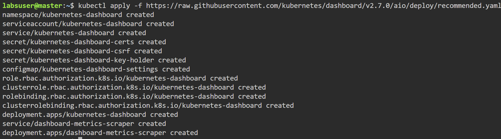
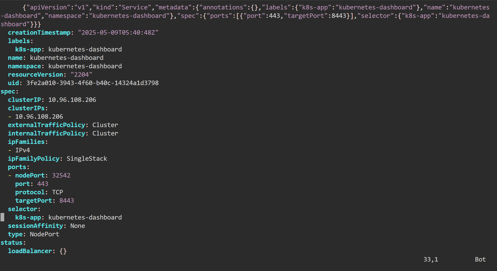
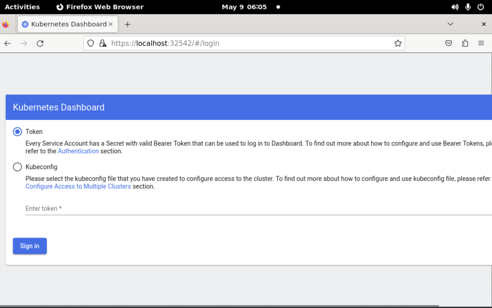
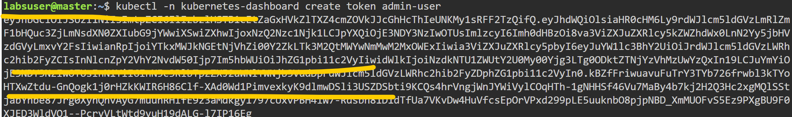
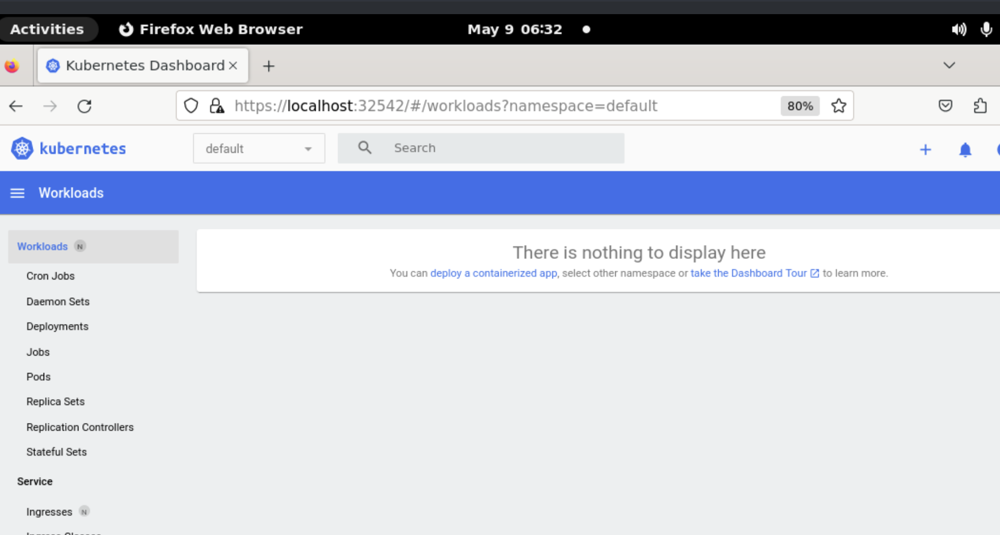

# Deploy an Application Using the Kubernetes Dashboard
This project demonstrates how to deploy a multi-tier MySQL application on Kubernetes. It includes configurations for user roles, storage, service verification, namespace restrictions, quota limits, and data management.

> **Note:** This project uses **k8s** as an alias for **Kubernetes** throughout the documentation.

## Prerequisites
- A Working k8s clustter
- `kubectl` command-line tool for communicating with the cluster.

## Setting up the k8s Dashboard

### Deploy the Dashboard
From the master node, execute the following command, 
- `$ kubectl apply -f https://raw.githubusercontent.com/kubernetes/dashboard/v2.7.0/aio/deploy/recommended.yaml`



### Editing the Service type of the Dashboard
Change the attribute type: `ClusterIP` to type: `NodePort` (Please note it will open with VI editor)
- `kubectl edit svc -n kubernetes-dashboard kubernetes-dashboard`



- Verifying the Service type changes `kubectl get svc -n kubernetes-dashboard -o wide`
```bash
labsuser@master:~$ kubectl get svc -n kubernetes-dashboard -o wide
NAME                        TYPE        CLUSTER-IP      EXTERNAL-IP   PORT(S)         AGE   SELECTOR
dashboard-metrics-scraper   ClusterIP   10.103.14.150   <none>        8000/TCP        14m   k8s-app=dashboard-metrics-scraper
kubernetes-dashboard        NodePort    10.96.108.206   <none>        443:32542/TCP   14m   k8s-app=kubernetes-dashboard
```
> **Note** Please note down the service(node-port) port number , here it is **32542**. We will use it for accessing the k8s dashboard through the browser.

### Accessing the k8s Dashboard

1. Click on the **Master** tab in the lab environment, then select the **Desktop** option. *(This is specific to this lab setup.)*
2. Open the **Firefox** browser.
3. Alternatively, launch a browser from any machine within the intranet and access the Master Node's IP address.
4. In Firefox, go to: `https://<localhost or IP address>:32542`
5. Click **Advanced** → **Accept the Risk and Continue** when prompted with a security warning.
6. A token is required to log in. Follow the upcoming steps to create a service account and generate the token.



### Create a Service Account and ClusterRoleBinding (for admin access)

In Master node,
#### Create the service account
```bash
$ vi ServiceAccount.yaml 
```
Copy and paste the following content inside the file and save it.

```YAML
apiVersion: v1
kind: ServiceAccount
metadata:
  name: admin-user
  namespace: kubernetes-dashboard
```
Create the service account
```bash
$ kubectl apply -f ServiceAccount.yaml
```
#### ClusterRoleBinding to ServiceAccount
```bash
$ vi ClusterRoleBinding.yaml
``` 
Copy and paste the following content inside the file and save it.
```YAML
apiVersion: rbac.authorization.k8s.io/v1
kind: ClusterRoleBinding
metadata:
  name: admin-user
roleRef:
  apiGroup: rbac.authorization.k8s.io
  kind: ClusterRole
  name: cluster-admin
subjects:
  - kind: ServiceAccount
    name: admin-user
    namespace: kubernetes-dashboard
```
Apply the binding
```bash
$ kubectl apply -f ClusterRoleBinding.yaml
```
### Get an Access Token
Now we need to find the token we can use to log in. Execute the following command
```bash
$ kubectl -n kubernetes-dashboard create token admin-user
```


Copy the token and paste it in Kubernetes Dashboard in Browser (In Step **Accessing the k8s Dashboard**).


