# Deploy an Application Using the Kubernetes Dashboard
This project demonstrates how to deploy a multi-tier MySQL application on Kubernetes. It includes configurations for user roles, storage, service verification, namespace restrictions, quota limits, and data management.

> **Note:** This project uses **k8s** as an alias for **Kubernetes** throughout the documentation.

## Prerequisites
- A Working k8s clustter
- `kubectl` command-line tool for communicating with the cluster.

## Setting up the k8s Dashboard

### Deploy the Dashboard
From the master node, execute the following command, 
- `$ kubectl apply -f https://raw.githubusercontent.com/kubernetes/dashboard/v2.7.0/aio/deploy/recommended.yaml`


### Editing the Service type of the Dashboard
Change the attribute type: `ClusterIP` to type: `NodePort` (Please note it will open with VI editor)
- `kubectl edit svc -n kubernetes-dashboard kubernetes-dashboard`


- Verifying the Service type changes `kubectl get svc -n kubernetes-dashboard -o wide`
```bash
labsuser@master:~$ kubectl get svc -n kubernetes-dashboard -o wide
NAME                        TYPE        CLUSTER-IP      EXTERNAL-IP   PORT(S)         AGE   SELECTOR
dashboard-metrics-scraper   ClusterIP   10.103.14.150   <none>        8000/TCP        14m   k8s-app=dashboard-metrics-scraper
kubernetes-dashboard        NodePort    10.96.108.206   <none>        443:32542/TCP   14m   k8s-app=kubernetes-dashboard
```
> **Note** Please note down the service(node-port) port number , here it is **32542**. We will use it for accessing the k8s dashboard through the browser.

### Accessing the k8s Dashboard

1. Click on the **Master** tab in the lab environment, then select the **Desktop** option. *(This is specific to this lab setup.)*
2. Open the **Firefox** browser.
3. Alternatively, launch a browser from any machine within the intranet and access the Master Node's IP address.
4. In Firefox, go to: `https://<localhost or IP address>:32542`
5. Click **Advanced** → **Accept the Risk and Continue** when prompted with a security warning.
6. A token is required to log in. Follow the upcoming steps to create a service account and generate the token.


### Create a Service Account and ClusterRoleBinding (for admin access)

In Master node,
#### Create the service account
```bash
$ vi ServiceAccount.yaml 
```
Copy and paste the following content inside the file and save it.

```YAML
apiVersion: v1
kind: ServiceAccount
metadata:
  name: admin-user
  namespace: kubernetes-dashboard
```
Create the service account
```bash
$ kubectl apply -f ServiceAccount.yaml
```
#### ClusterRoleBinding to ServiceAccount
```bash
$ vi ClusterRoleBinding.yaml
``` 
Copy and paste the following content inside the file and save it.
```YAML
apiVersion: rbac.authorization.k8s.io/v1
kind: ClusterRoleBinding
metadata:
  name: admin-user
roleRef:
  apiGroup: rbac.authorization.k8s.io
  kind: ClusterRole
  name: cluster-admin
subjects:
  - kind: ServiceAccount
    name: admin-user
    namespace: kubernetes-dashboard
```
Apply the binding
```bash
$ kubectl apply -f ClusterRoleBinding.yaml
```
### Get an Access Token
Now we need to find the token we can use to log in. Execute the following command
```bash
$ kubectl -n kubernetes-dashboard create token admin-user
```


Copy the token and paste it in Kubernetes Dashboard in Browser (In Step **Accessing the k8s Dashboard**).


## Create a New Namespace in the Application

Follow the steps below to create a new namespace using the Kubernetes Dashboard:

1. Open the **k8s Dashboard**.
2. Click the **Add** button in the top-right corner to create a new resource.
3. Choose the **Create from input** option.
4. Copy and paste the following YAML content into the editor.
5. Click **Upload** to apply the configuration.
```YAML
apiVersion: v1
kind: Namespace
metadata:
  name: wordpress-web-app
  labels:
    project: wordpress-deployment
    environment: dev
```

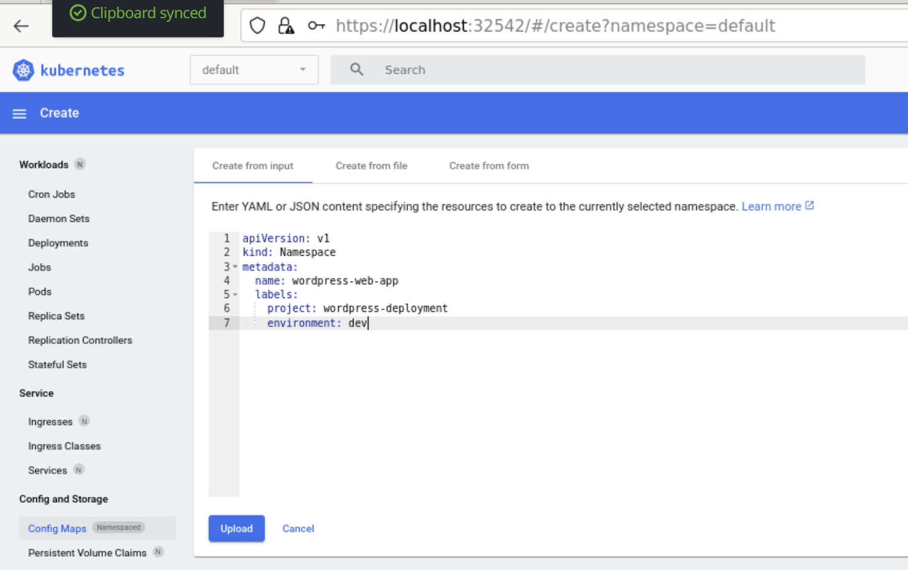

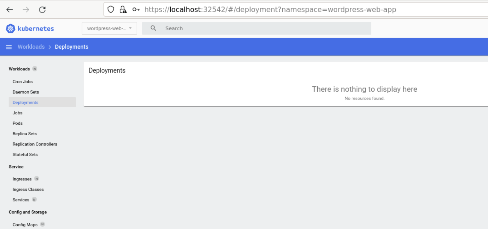

## Create the ConfigMap
1. Select the namespace **wordpress-web-app** in **k8s Dashboard**.
2. Click the **Add** button in the top-right corner to create a new resource.
3. Choose the **Create from input** option.
4. Copy and paste the following YAML content into the editor.
5. Click **Upload** to apply the configuration.

```YAML
apiVersion: v1
kind: ConfigMap
metadata:
  name: wordpress-config
  namespace: wordpress-web-app
data:
  WORDPRESS_DB_HOST: "mysql-service"
  WORDPRESS_DB_NAME: "wordpress_db"
```


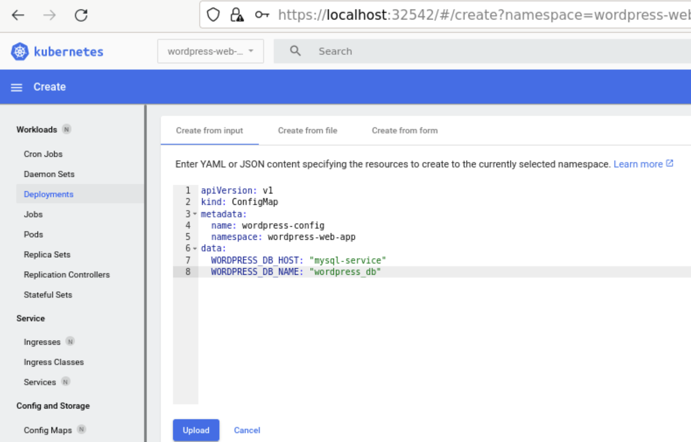

## Create the Secret
1. Select the namespace **wordpress-web-app** in **k8s Dashboard**.
2. Click the **Add** button in the top-right corner to create a new resource.
3. Choose the **Create from input** option.
4. Copy and paste the following YAML content into the editor.
5. Click **Upload** to apply the configuration.

```YAML
apiVersion: v1
kind: Secret
metadata:
  name: app-credentials
  namespace: wordpress-web-app
type: Opaque
data:
  MYSQL_ROOT_PASSWORD: "d2ViYXBwQDEyMw=="
  MYSQL_DATABASE: "d29yZHByZXNzX2Ri"
  MYSQL_USER: "d3BfdXNlcg=="                                     
  MYSQL_PASSWORD: "d2ViYXBwQDEyMw=="
  WORDPRESS_DB_USER: "d3BfdXNlcg=="
  WORDPRESS_DB_PASSWORD: "d2ViYXBwQDEyMw=="
  WORDPRESS_AUTH_KEY: "d2ViYXBwd29yZHByZXNzQDEyMw=="
  WORDPRESS_SECURE_AUTH_KEY: "d2ViYXBwd29yZHByZXNzQDEyMw=="
  WORDPRESS_LOGGED_IN_KEY: "d2ViYXBwd29yZHByZXNzQDEyMw=="
  WORDPRESS_NONCE_KEY: "d2ViYXBwd29yZHByZXNzQDEyMw=="
  WORDPRESS_AUTH_SALT: "d2ViYXBwd29yZHByZXNzQDEyMw=="
  WORDPRESS_SECURE_AUTH_SALT: "d2ViYXBwd29yZHByZXNzQDEyMw=="
  WORDPRESS_LOGGED_IN_SALT: "d2ViYXBwd29yZHByZXNzQDEyMw=="
  WORDPRESS_NONCE_SALT: "d2ViYXBwd29yZHByZXNzQDEyMw=="
```

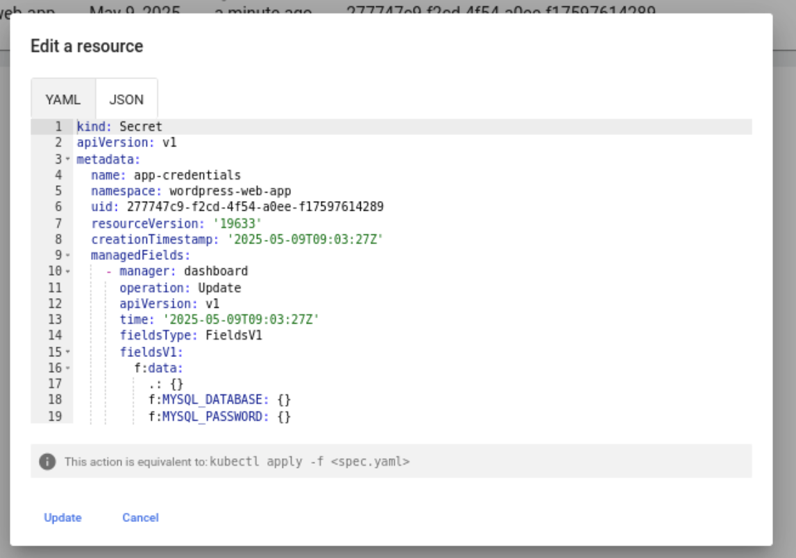

## Configuring Pod Using NFS based PersistentVolume (PV) and PersistentVolumeClaim (PVC)

### Configure the NFS Kernel Server

1. Go to the worker-node-1
2. Create the directory
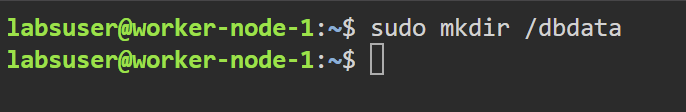
3. Install the NFS kernel server on the machine:
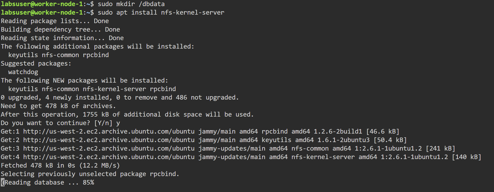
4. To grant permission to access the host server machine, open the exports file in the /etc directory
```bash
$ sudo nano /etc/exports
```
5. Inside the file, append the following code:
`/dbdata 	*(rw,sync,no_root_squash)`
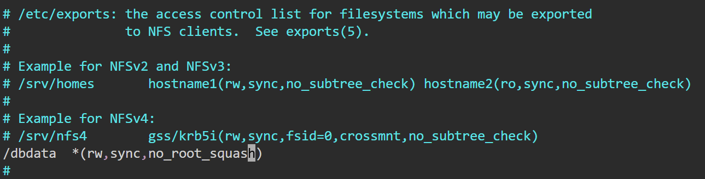
6. To export all shared directories, you have defined in the /etc/exports file, use:
```bash
sudo exportfs -rv
```
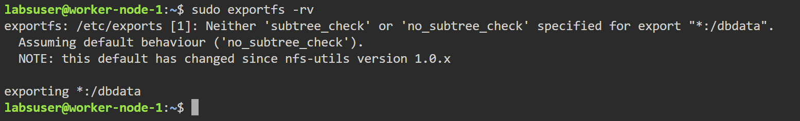
7. Make the folder publicly accessible by changing its owner user and group:
```bash
$ sudo chown nobody:nogroup /dbdata/
```
8. Assign full permissions to ensure everyone can read, write, and execute files in this directory:
```bash
$ sudo chmod 777 /dbdata/
```
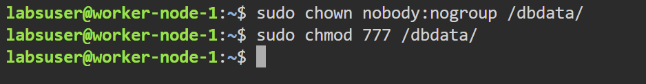
9. Restart the NFS kernel server to apply the changes:
```bash
$ sudo systemctl restart nfs-kernel-server
```
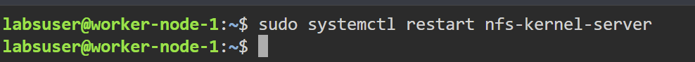

10. Retrieve the internal IP of the node where NFS Server is installed, which will be used to link the PV
```bash
$ ip a
```
After running this command, look for the relevant IP address in the output. This IP will be used to associate the PV with the NFS server. We will be using IP in step 4.


11. Configure the NFS common on client machines
> **Note**  Perform these steps on each **worker node** intended for sharing.

Run the following command to install the NFS common package:
```bash
$ sudo apt install nfs-common
```
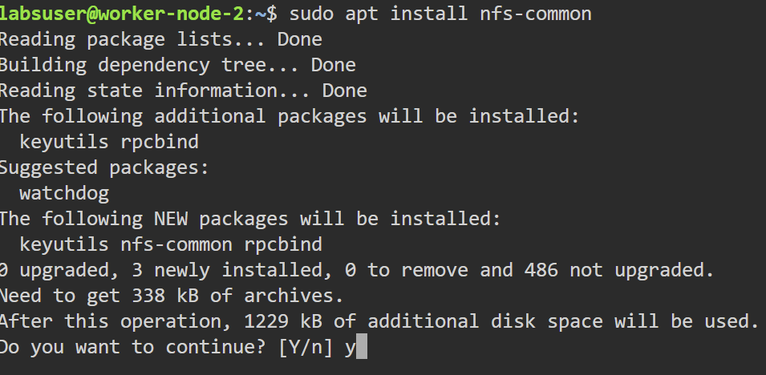

12. Execute the following commands to refresh the NFS common service and verify its current status:
```bash
$ sudo rm /lib/systemd/system/nfs-common.service
$ sudo systemctl daemon-reload
$ sudo systemctl restart nfs-common
$ sudo systemctl status nfs-common
```
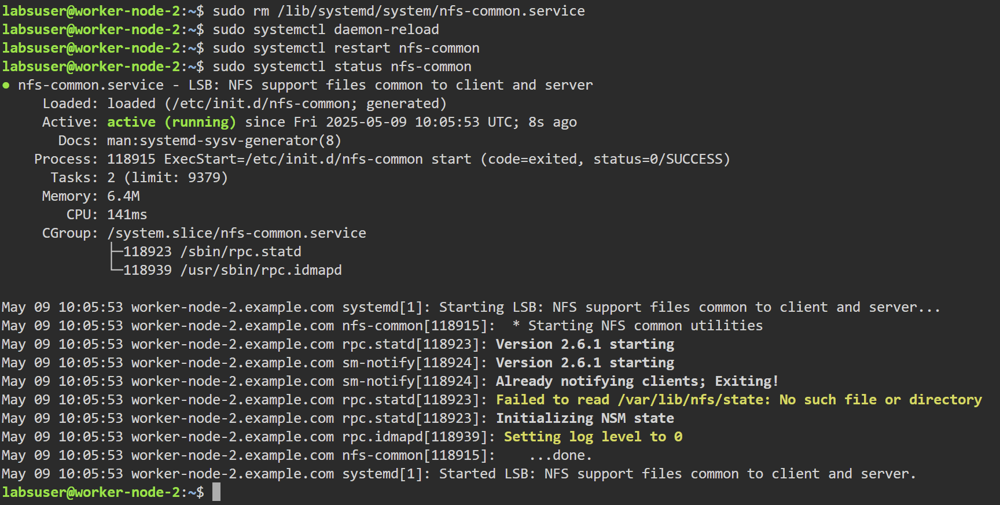

### Create the PersistentVolume
1. Create the `CreatePersistentVolume.yaml` with the following content
```bash
$ vi CreatePersistentVolume.yaml
```
```YAML
apiVersion: v1
kind: PersistentVolume
metadata:
  name: mysql-nfs-pv
  labels:
    type: nfs-storage
    app: mysql
spec:
  capacity:
    storage: 10Gi
  volumeMode: Filesystem
  accessModes:
    - ReadWriteOnce
  storageClassName: manual-nfs
  nfs:
    path: /dbdata
    server: 172.31.0.228
    readOnly: false
```
2. Create the PersistentVolume
```bash
$ kubectl apply -f CreatePersistentVolume.yaml
```
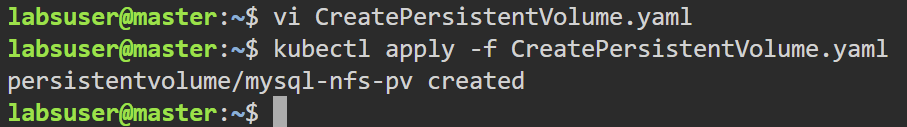
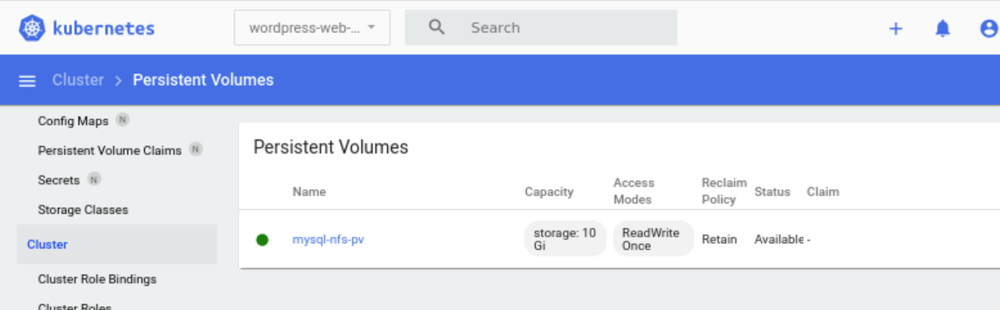

### Create the PersistentVolumeClaim
1. Create the `CreatePersistentVolumeClaim.yaml` with the following content
```bash
$ vi CreatePersistentVolumeClaim.yaml
```
```YAML
apiVersion: v1
kind: PersistentVolumeClaim
metadata:
  name: mysql-nfs-pvc
  namespace: wordpress-web-app
spec:
  accessModes:
    - ReadWriteOnce
  volumeMode: Filesystem
  resources:
    requests:
      storage: 8Gi
  storageClassName: manual-nfs
```
2. Create the PersistentVolumeClaim
```bash
$ kubectl apply -f CreatePersistentVolumeCalim.yaml
```
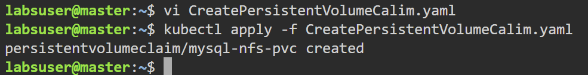
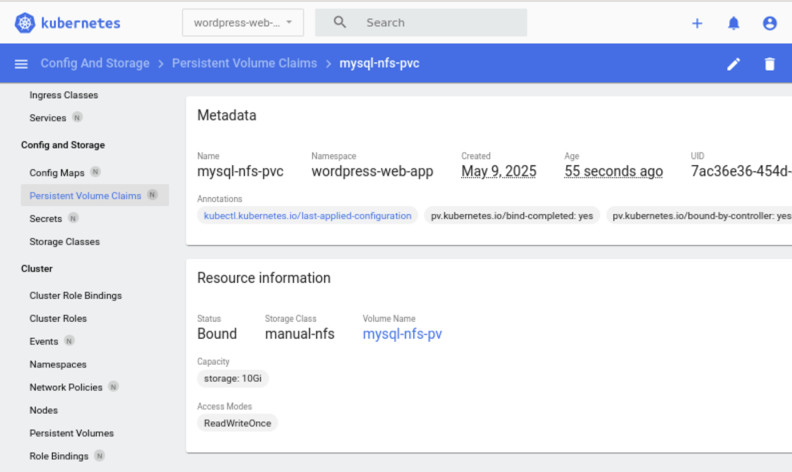

## Create MySQL Deployment and Service
### Create MySQL Deployment
1. Create the `MysqlDeployment.yaml` with the following content
```YAML
apiVersion: apps/v1
kind: Deployment
metadata:
  name: mysql
  namespace: wordpress-web-app
  labels:
    app: mysql
    tier: database
spec:
  replicas: 1
  selector:
    matchLabels:
      app: mysql
      tier: database
  strategy:
    type: Recreate
  template:
    metadata:
      labels:
        app: mysql
        tier: database
    spec:
      securityContext:
        fsGroup: 999
      containers:
      - name: mysql
        image: mysql:8.0
        envFrom:
        - secretRef:
            name: app-credentials
        ports:
        - containerPort: 3306
          name: mysql
        volumeMounts:
        - name: mysql-persistent-storage
          mountPath: /var/lib/mysql
        livenessProbe:
          tcpSocket:
            port: 3306
          initialDelaySeconds: 30
          periodSeconds: 10
        readinessProbe:
          exec:
            command: ["mysqladmin", "ping", "-h", "127.0.0.1"]
          initialDelaySeconds: 5
          periodSeconds: 10
          timeoutSeconds: 1
      volumes:
      - name: mysql-persistent-storage
        persistentVolumeClaim:
          claimName: mysql-nfs-pvc
```
### Create the MySQL Service
1. Create the `MysqlService.yaml` with the following content
```YAML
apiVersion: v1
kind: Service
metadata:
  name: mysql-service
  namespace: wordpress-web-app
  labels:
    app: mysql
    tier: database
spec:
  ports:
  - port: 3306
    targetPort: 3306
  selector:
    app: mysql
    tier: database
  type: ClusterIP
```
### Apply the MySQL
```bash
$ kubectl get pv mysql-nfs-pv
$ kubectl get pvc mysql-nfs-pvc -n wordpress-web-app
$ kubectl apply -f MysqlDeployment.yaml
$ kubectl apply -f MysqlService.yaml
```

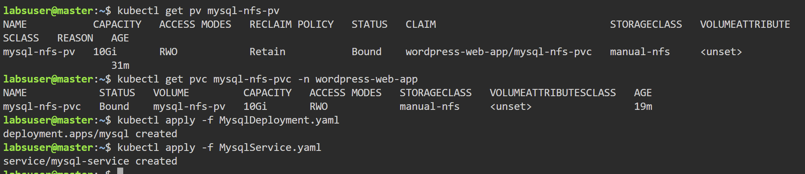
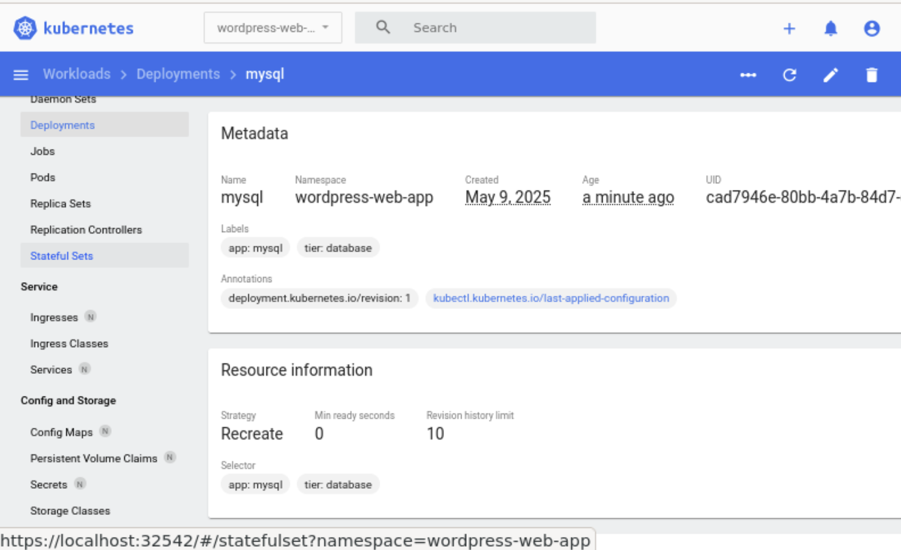
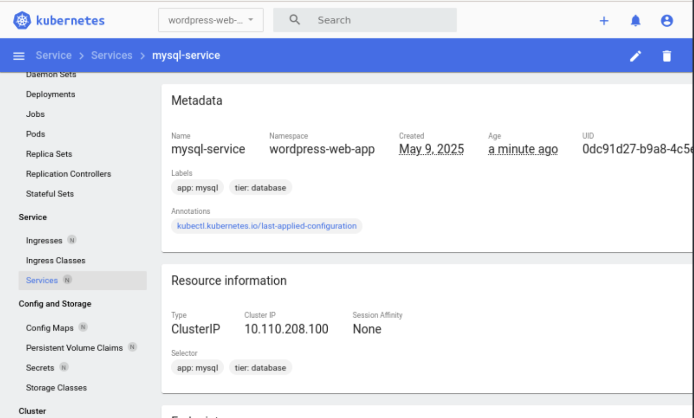
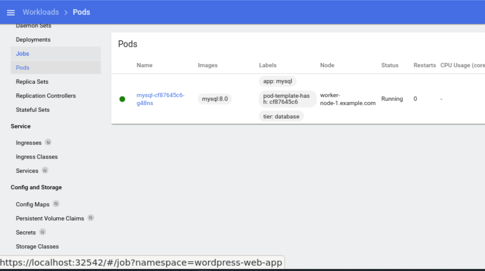

## Create Wordpress Deployment and Service
### Create Wordpress Deployment
1. Create the `WordpressDeployment.yaml` with the following content
```YAML
apiVersion: apps/v1
kind: Deployment
metadata:
  name: mysql
  namespace: wordpress-web-app
  labels:
    app: mysql
    tier: database
spec:
  replicas: 1
  selector:
    matchLabels:
      app: mysql
      tier: database
  strategy:
    type: Recreate
  template:
    metadata:
      labels:
        app: mysql
        tier: database
    spec:
      securityContext:
        fsGroup: 999
      containers:
      - name: mysql
        image: mysql:8.0
        envFrom:
        - secretRef:
            name: app-credentials
        ports:
        - containerPort: 3306
          name: mysql
        volumeMounts:
        - name: mysql-persistent-storage
          mountPath: /var/lib/mysql
        livenessProbe:
          tcpSocket:
            port: 3306
          initialDelaySeconds: 30
          periodSeconds: 10
        readinessProbe:
          exec:
            command: ["mysqladmin", "ping", "-h", "127.0.0.1"]
          initialDelaySeconds: 5
          periodSeconds: 10
          timeoutSeconds: 1
      volumes:
      - name: mysql-persistent-storage
        persistentVolumeClaim:
          claimName: mysql-nfs-pvc
```
### Create the MySQL Service
1. Create the `MysqlService.yaml` with the following content
```YAML
apiVersion: v1
kind: Service
metadata:
  name: mysql-service
  namespace: wordpress-web-app
  labels:
    app: mysql
    tier: database
spec:
  ports:
  - port: 3306
    targetPort: 3306
  selector:
    app: mysql
    tier: database
  type: ClusterIP
```
### Apply the MySQL
```bash
$ kubectl get pv mysql-nfs-pv
$ kubectl get pvc mysql-nfs-pvc -n wordpress-web-app
$ kubectl apply -f MysqlDeployment.yaml
$ kubectl apply -f MysqlService.yaml
```


